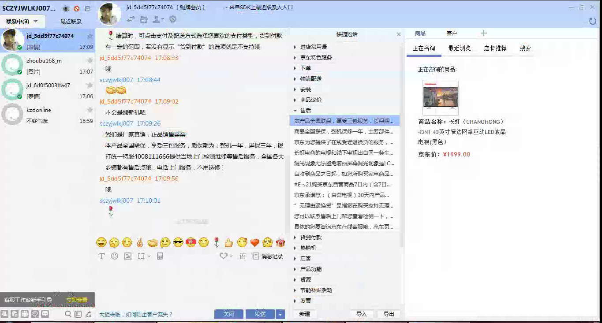

# hello world~ #

    void CSendMsgTask::HandleFailure(CMessage& msg)
    {
    	CFailureSubMsg* subMsg = dynamic_cast<CFailureSubMsg*>(msg.SubMessage());
    	if (subMsg != NULL)
    	{
    		if (subMsg->Type() == "chat" || subMsg->Type() == "chat_message")
    		{
    			SendingParam param(NULL, 0, "", L"", L"");
    			{
    				CAutoLock lock(&m_sendingMutex);
    				std::map<std::string, SendingParam>::iterator iter = m_sendingMsgs.find(msg.Id());
    				if (iter != m_sendingMsgs.end())
    				{
    					param = iter->second;
    					m_sendingMsgs.erase(iter);
    				}
    			}
    			if (::IsWindow(param.m_hWnd))
    			{
    				::SendMessage(param.m_hWnd, JD_MSG_SEND_CHAT_MSG, 1, (LPARAM)&param);
    			}
    		}
    	}
    }

- hello
- world
1. frfr
2. 3r43r43
3. r43r43
4. r43r43r43
5. JD_MSG_SEND_CHAT_MSG

----------
> ferfrefrefrefre
> 
11/18/2016 11:39:15 AM 